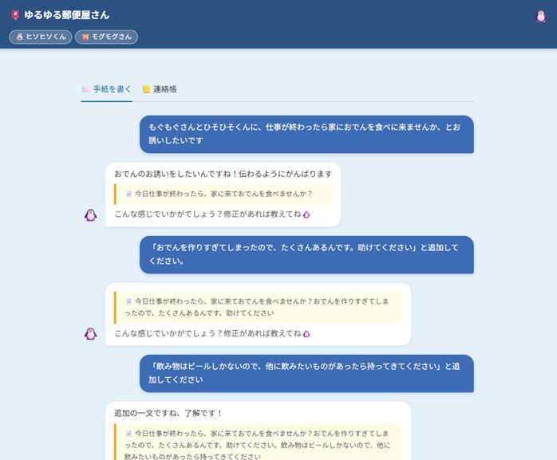

# 🐧 ゆるゆる郵便屋さん

> ペンくんと一緒にお手紙を書いて、キャラクターに届けよう。

[](https://yuruyuru-postman.streamlit.app/)



---

## 📋 アプリ概要

ペンギンの郵便屋さん「ペンくん🐧」と一緒に、キャラクターへのお手紙を書いて届けるAIチャットアプリです。

「誰に」「どんな内容を送りたいか」をペンくんに話しかけるだけで、AIがいい感じの文面を提案してくれます。モバイル対応済みなので、スマホからでも気軽に使えます。

**🔗 デモ：https://yuruyuru-postman.streamlit.app/**

---

## ✨ 主な機能

| 機能 | 説明 |
|------|------|
| ✉️ 手紙作成チャット | ペンくんとチャットしながら文面を一緒に考える |
| 📮 宛先キャラクター | 6人＋ペンくん本人の計7キャラから最大2人に送れる |
| 🐧 配達アニメーション | ペンくんが画面を横断して届けに行く演出 |
| 😱 ペンくんサプライズ | ペンくん宛てに送ると、配達中に自分宛てと気づくびっくり演出 |
| 📋 感想表示 | 受取人キャラクターが個性豊かな感想を返してくれる |
| 👥 2人同時配達 | 最大2人のキャラへ同じ手紙を届けられる |

---

## 🎭 キャラクター一覧

| キャラ | 名前 | 役職 |
|--------|------|------|
| 🐼 | プルプル部長 | 58歳・昭和気質の部長 |
| 🐰 | ヒソヒソくん | ひそやかな情報通 |
| 🐱 | フワフワさん | ふんわり系OL |
| 🐺 | ガブガブくん | 体育会系営業 |
| 🐹 | モグモグさん | おっとり経理 |
| 🦊 | ピカピカちゃん | 頭脳派企画職 |
| 🐧 | ペンくん | ゆるゆる郵便屋さん（自分自身） |

---

## 🖥️ 画面構成

```
【手紙作成画面】
ペンくんとチャット（宛先・内容を相談）
　↓
文面提案 ＋「✈️ 送る」確認ボタン
　↓
送り主のお名前を確認

【配達中画面】
ペンくんが走って届けに行くアニメーション
　※ペンくん宛ての場合：配達中に自分宛てと気づく演出あり

【感想画面】
受取人の家 ＋ 届いたお手紙 ＋ キャラクターの感想
　↓（2人宛ての場合）
2人目へ届けに行く → 感想画面（タブ切替で両方確認可能）
　↓
「また書く」ボタン → ペンくんが帰宅 → 手紙作成画面へ
```

---

## 🛠️ 技術スタック

| 要素 | 内容 |
|------|------|
| フレームワーク | [Streamlit](https://streamlit.io/) |
| AI | [Groq API](https://groq.com/)（llama-3.3-70b-versatile） |
| 言語 | Python 3.x |
| デプロイ | Streamlit Community Cloud |
| 外部API連携 | なし |

---

## 💡 工夫したポイント

### AIプロンプト設計
- 文面提案の出力を **JSON形式（pre / body / post の3フィールド）** で明示し、パースを安定させた
- Groqが散文テキスト＋JSONを混在させて返す場合に備えた **Try2フォールバック**（正規表現でJSON部分を抽出）を実装
- 送信意図の検出に **`[DELIVER]`タグ方式**を採用。「手伝ってください」などの作成依頼と誤検出しないよう過検出防止ルールをプロンプトに明示
- ペンくん宛てのお手紙でも、**代筆中はペンくんが自分宛てと気づかないふり**をするよう指示。配達中にはじめて気づく演出を実現

### UI / UX
- 確定トリガー文字列マッチと`[DELIVER]`タグ方式の**二段階送信方式**：明示的な「送って」は即配達、AIが送信意図を検出したときは確認ボタンを表示
- 感想生成APIとアニメーションを **`concurrent.futures.ThreadPoolExecutor`で並列実行**し、待ち時間を最小化
- 固定ヘッダーの余白を宛先バッジの有無に応じて動的に制御（iPhone Safari対応）
- `[data-testid="stChatInput"]` へのCSS直接指定でStreamlitデフォルトの入力欄を見やすくスタイリング

### キャラクター設計
- 🐧 **ペンくん**：普段はサポート役だが、自分宛てのお手紙を受け取ると驚いて照れる。「ゆるゆるシリーズ」共通の脇役→主役化演出
- 🐼 **プルプル部長**・🐰 **ヒソヒソくん**：「ゆるゆる報告書」と共通キャラ。シリーズを通じて世界観を統一

---

## 📁 ファイル構成

```
yuruyuru_postman/
├── app.py                     # メインアプリ（単一ファイル、約970行）
├── requirements.txt           # UTF-8で保存すること（重要）
├── .gitignore
├── .streamlit/
│   ├── config.toml            # headless=true, テーマ設定
│   └── secrets.toml           # GROQ_KEY="..." (.gitignore済み)
└── CLAUDE.md                  # AI引継ぎ資料
```

---

## 🚀 ローカルで動かす

```bash
# 1. リポジトリをクローン
git clone https://github.com/yamawaki64-design/yuruyuru_postman.git
cd yuruyuru_postman

# 2. 依存パッケージをインストール
pip install -r requirements.txt

# 3. APIキーを設定
#    .streamlit/secrets.toml を作成して以下を記載
#    GROQ_KEY = "your_groq_api_key"

# 4. 起動
streamlit run app.py
```

> **Groq API キーの取得**：https://console.groq.com/ から無料で取得できます。

---

## 🔮 今後の検討事項

- [ ] Zenn記事の公開
- [ ] キャラクター追加
- [ ] 手紙の保存・履歴機能

---

## 👤 作者

AIエージェント構成と設計を示すポートフォリオとして開発しました。

<!-- TODO: 名前・SNSリンク・Zenn記事URLなどを追記してください -->
<!-- - Zenn: https://zenn.dev/yourname -->
<!-- - Twitter/X: @yourhandle -->
